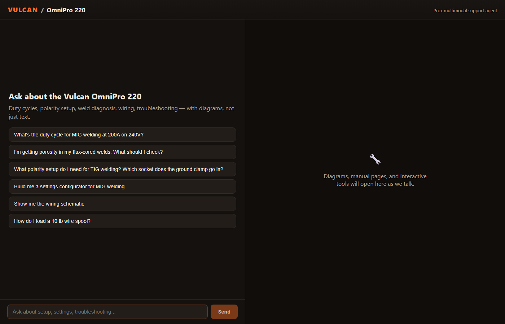
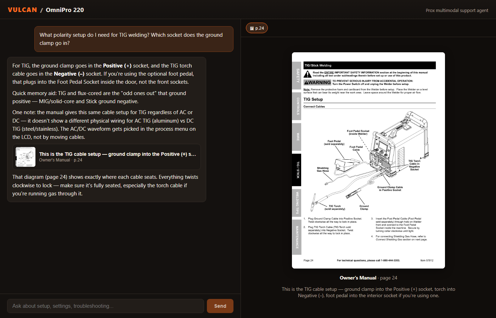
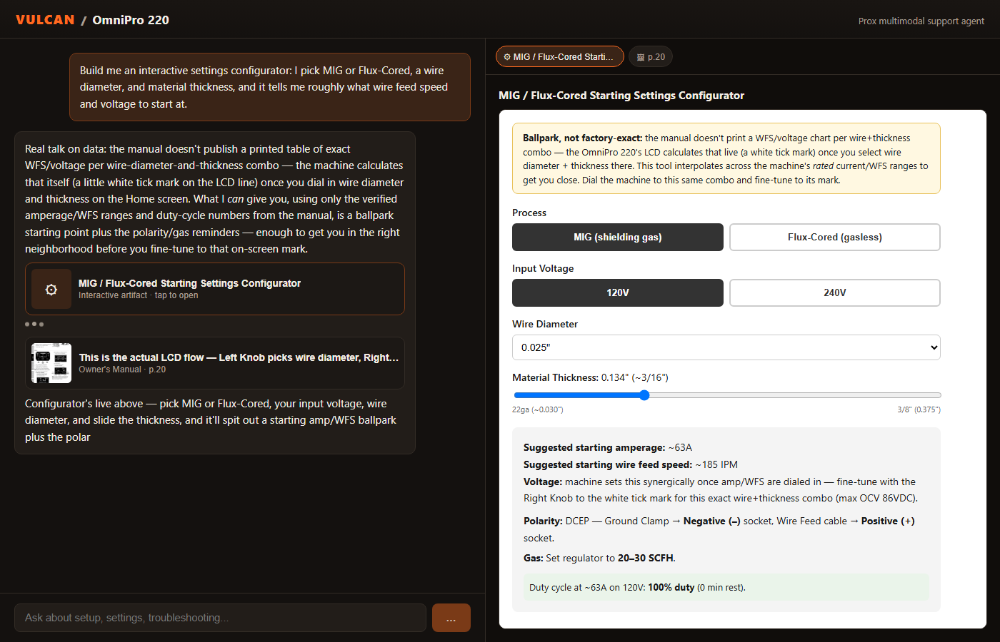

# Prox — Vulcan OmniPro 220 Assistant

A multimodal support agent for the [Vulcan OmniPro 220](https://www.harborfreight.com/omnipro-220-industrial-multiprocess-welder-with-120240v-input-57812.html) multiprocess welder, built on the **Claude Agent SDK**. It answers deep technical questions about the machine — duty cycles, polarity setup, weld diagnosis, wiring — and, where a picture beats a paragraph, it shows one: a real page from the manual, or a live interactive tool it builds on the spot.



## Quick start

```bash
git clone <your-fork>
cd <your-fork>
cp .env.example .env   # add your ANTHROPIC_API_KEY
npm install
npm run dev
```

Open `http://localhost:5173`. That's it — one install command, one run command, as requested. No Poppler, no Ghostscript, no Python: the PDF pipeline runs on pure npm packages (see [Knowledge extraction](#knowledge-extraction) below), and its output is already committed to the repo under `data/manual/`, so the app never touches a PDF at runtime.

## What it does

Ask it things like:

- *"What's the duty cycle for MIG welding at 200A on 240V?"* → exact answer (25%, 2.5 min weld / 7.5 min rest) cross-referenced across the spec table, the rating label, and the duty-cycle reference cards, plus the reference page image.
- *"What polarity setup do I need for TIG welding? Which socket does the ground clamp go in?"* → ground clamp → Positive, torch → Negative, **and** the actual manual diagram for page 24, auto-opened alongside the answer.
- *"I'm getting porosity in my flux-cored welds. What should I check?"* → ranked list of causes specific to self-shielded flux-cored (not gas-shielded MIG), because the agent knows those failure modes differ.
- *"Build me a settings configurator for MIG welding"* → a live, self-contained interactive tool (process/voltage/wire-diameter/thickness → suggested amperage, wire speed, polarity, gas flow), built from the verified duty-cycle and current-range data — not guessed.





## Architecture

```
prox-vulcan-agent/
├── files/                    source PDFs (owner's manual, quick-start, selection chart)
├── scripts/extract-manual.ts one-time PDF → images + raw text pipeline
├── data/manual/               committed output: page images + manifest.json
├── server/                    Express + Claude Agent SDK backend
│   └── src/
│       ├── knowledge.ts       hand-curated, verified knowledge base + image catalog
│       ├── tools.ts           the agent's two custom tools (in-process MCP server)
│       ├── agent.ts           system prompt + query() wrapper → structured event stream
│       ├── routes/chat.ts     POST /api/chat, streams NDJSON
│       └── index.ts           Express app, static image serving
└── client/                    React + Vite frontend
    └── src/
        ├── App.tsx             chat state machine, streaming consumer
        ├── components/
        │   ├── MessageBubble.tsx   markdown text + inline image/artifact cards
        │   └── CanvasPanel.tsx     Claude-artifacts-style side panel (images + live iframes)
        └── api.ts               NDJSON streaming client
```

**Backend**: a single `POST /api/chat` endpoint runs `query()` from `@anthropic-ai/claude-agent-sdk` per turn, with all of Claude Code's built-in tools disabled (`tools: []`) and only two custom tools registered through an in-process MCP server (`createSdkMcpServer`). Multi-turn context is handled by the SDK's own session store (`resume: sessionId`) rather than the app re-sending history — the client just remembers the session id it got back.

**Streaming**: the SDK's `query()` result is an async generator of Anthropic-shaped messages. The server re-emits it as newline-delimited JSON (not strict SSE) over a plain chunked HTTP response — this keeps the client to a single `fetch` + `ReadableStream` reader, works fine with `POST` bodies (unlike `EventSource`, which is `GET`-only), and needs no extra library on either side. Token-level text deltas come from `stream_event`/`content_block_delta` frames for a responsive typewriter effect; tool calls are only acted on once their `assistant` message block is complete, so the frontend never has to parse partial JSON.

## The two tools — this is the multimodal core

The system prompt tells the agent, explicitly: *plain text is your fallback, not your default*. It has two tools, and a real answer to a non-trivial question usually uses at least one:

- **`show_manual_image(imageId, caption)`** — surfaces a real page from the manual. `imageId` must match an id in a curated catalog of ~28 diagram/chart/photo pages (front panel, polarity diagrams, weld-defect photos, the wiring schematic, the parts diagram, the process-selection chart, ...) that's enumerated directly in the system prompt. The id is validated server-side against the same catalog before the frontend ever sees it.
- **`render_artifact(title, html)`** — the "reverse-engineered Claude artifact." The agent writes a self-contained HTML/CSS/JS fragment (no external resources, no imports), which the frontend renders in a sandboxed `<iframe sandbox="allow-scripts">` — scripts run, but the iframe gets no `allow-same-origin`, so generated code can never reach the parent page, cookies, or `localStorage`. This is what produces the duty-cycle calculator and the settings configurator: real sliders and buttons wired to the verified numbers in the knowledge base, not a static description of one.
  - Generated JS isn't perfect — during testing, one generation had a genuine syntax error (a double-escaped apostrophe inside a single-quoted string), which silently broke every handler in that artifact with no visible error. `server/src/tools.ts` now compiles every `<script>` block server-side (`new Function(...)`) before an artifact is ever shown; a broken one is rejected with the exact parse error fed back to the model so it can self-correct, instead of shipping broken interactivity to the user.

Both tool calls stream to the frontend as structured events (`{type: "image", ...}` / `{type: "artifact", ...}`) alongside the text, and open automatically in a right-hand canvas panel — modeled on how artifacts behave in claude.ai — with a tab strip so earlier diagrams/tools from the same conversation stay reachable.

## Knowledge extraction

The manual is 48 dense pages: duty-cycle matrices split across three tables that only agree if you cross-reference them, safety text and diagrams sharing the same column layout, and several pages (the wiring schematic, the process-selection chart) that carry critical information **only** as an image.

Two decisions here, and why:

**1. Rendering, not OCR-dependent extraction, and no system dependencies.** `scripts/extract-manual.ts` uses `pdfjs-dist` + `@napi-rs/canvas` — both pure npm packages with prebuilt native binaries — to render every page of all three PDFs to a PNG and pull its text layer. No Poppler, no Ghostscript, nothing to install on the grader's machine. Output is committed under `data/manual/` (images + `manifest.json`), so `npm run extract` only needs to be re-run if the source manuals change.

**2. A hand-verified knowledge base instead of RAG.** For a 50-page manual, chunk-and-embed retrieval trades accuracy for a problem it doesn't have: the whole thing fits comfortably in context, and prompt caching makes that cheap after turn one. More importantly, several of the target questions *require* cross-referencing sections that a similarity search would never put in the same chunk — the duty-cycle number on the Specifications page, the rating label silkscreened on the machine (photographed on a different page), and the reference cards in the welding-tips section all needed to be read together and checked against each other before I'd trust the number. `server/src/knowledge.ts` is that verified result: every duty-cycle figure, every polarity socket assignment, and every troubleshooting cause was checked against the extracted text of the specific page it comes from (cited in comments), and the file says so explicitly where the manual is ambiguous or silent (e.g., it does **not** invent a different cable configuration for AC vs. DC TIG, because the manual doesn't show one — the agent says exactly that when asked, instead of guessing). This is also why the interactive configurator artifact is careful to label its interpolated values as estimates: the manual gives three verified anchor points per process/voltage, not a continuous table, and the agent knows the difference.

The `IMAGE_CATALOG` in the same file is the bridge between the two tools: each entry pairs a real page image with a short human-written title and tag list, so the agent can pick the right page id without ever seeing raw file paths.

## Design decisions

- **Tone.** The system prompt explicitly frames the user as "just bought this, standing in their garage" — competent but not a professional welder. No filler openers, safety notes only when relevant to what was asked, ambiguity resolved with either one short question or (preferably) a configurator artifact instead of a wall of clarifying questions.
- **Model.** Defaults to `claude-sonnet-5` (override with `PROX_MODEL` in `.env`) — strong enough for the cross-referencing this domain needs, without the standing cost of always running the largest model for a support chat.
- **Dark, Vulcan-branded UI.** Matches the product's own black/orange packaging rather than a generic chat skin — small thing, but it's the kind of detail that makes a support tool feel like it belongs to the product.
- **No coding-agent baggage.** `systemPrompt: { type: "custom", prompt, snapshot: true }` fully replaces the Claude Code default prompt rather than appending to it — this is a support agent, not a coding assistant, and it shouldn't inherit either persona or tool habits from the latter. `snapshot: true` also pins the prompt for the life of a session so cache reuse and multi-turn coherence aren't disturbed by a mid-conversation prompt tweak.

## What I'd add with more time

- Voice input/output (mentioned as a stretch goal in the brief) — didn't chase it to keep the two multimodal tools and the knowledge base rock-solid first.
- A visual crop of the specific diagram on a page instead of the full page image, for the few pages that mix a diagram with unrelated safety text.
- Persisting the session id in `localStorage` so a page refresh doesn't lose conversation continuity (session state itself already survives on the server via the SDK's session store — only the client-side pointer to it is in-memory today).

## Deploying (Render, free tier)

`render.yaml` at the repo root defines both services as a Blueprint — no manual dashboard wiring needed beyond one secret:

1. Push this repo to your own GitHub account.
2. In Render: **New → Blueprint**, point it at your fork. It reads `render.yaml` and provisions two free services:
   - `prox-vulcan-agent-api` — the Express backend (Node web service).
   - `prox-vulcan-agent-web` — the static frontend build, wired to the backend's URL automatically via a `fromService` reference (no hardcoded URL to keep in sync).
3. Render will prompt you for the one secret it can't infer: `ANTHROPIC_API_KEY` on the API service.
4. Deploy. First load may take 30–50s if the free backend has spun down from inactivity (Render's free web services sleep after 15 min idle) — normal, not a bug.

No credit card is required for Render's free web service tier as of this writing; verify current terms yourself before relying on it, since hosting platform free-tier policies do change. Separately: hosting being free doesn't make usage free — you're still billed by Anthropic for API calls regardless of where the app runs.

## Requirements

- Node.js 20+
- An Anthropic API key with access to Claude (set as `ANTHROPIC_API_KEY` in `.env` for local dev, or as a Render secret for deployment)
